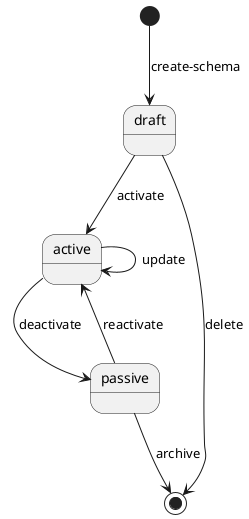

# Şema Yaşam Döngüsü Workflowu

## Genel Bakış
<!-- Kullanıcı düzenlenebilir bölüm -->
Şema Yaşam Döngüsü Workflowu, Amorphie platformu içerisindeki JSON Schema tanımlarının tam yaşam döngüsünü yönetir. Bu workflow, şema tanımlarının doğru versiyonlama, doğrulama ve tüm domain projelerine dağıtımını sağlar.

<!-- OTOMATİK ÜRETİLMİŞ - MANUEL DÜZENLEME YAPMAYIN -->

### Mevcut Versiyonlar
- **Versiyon 1.0.0** (Güncel)
- **Domain**: Core
- **Key**: Schema
- **Tags**: Core, Schema, Lifecycle, Repository

### Durum Makinesi Diyagramı

### Durum Tanımları

#### Taslak Durumu (start)
- **Key**: `draft`
- **Tip**: `start`
- **Etiketler**: 
  - EN: "Draft State"
  - TR: "Taslak Durumu"
- **Mevcut Geçişler**: `activate`, `delete`
- **Görünümler**: [SchemaFullView](../../View/docs/SchemaFullView.md)

#### Aktif Durum (normal)
- **Key**: `active`
- **Tip**: `normal` 
- **Etiketler**:
  - EN: "Active State"
  - TR: "Aktif Durumu"
- **Mevcut Geçişler**: `deactivate`, `update`
- **Görünümler**: [SchemaFullView](../../View/docs/SchemaFullView.md)

#### Pasif Durum (finish)
- **Key**: `passive`
- **Tip**: `normal`
- **Etiketler**:
  - EN: "Passive State"
  - TR: "Pasif Durumu"
- **Mevcut Geçişler**: `reactivate`, `archive`
- **Görünümler**: [SchemaFullView](../../View/docs/SchemaFullView.md)

### Geçiş Tanımları

#### create-schema (Başlangıç Geçişi)
- **Hedef**: `draft`
- **Tip**: `forward`
- **Etiketler**:
  - EN: "Create Schema"
  - TR: "Şema Oluştur"
- **Şema**: schema-creation-input (Core/Schema/1.0.0)

#### activate
- **Kaynak**: `draft` → **Hedef**: `active`
- **Tip**: `forward`
- **Etiketler**:
  - EN: "Activate Schema"
  - TR: "Şemayı Aktifleştir"

#### update
- **Kaynak**: `active` → **Hedef**: `active`
- **Tip**: `self`
- **Etiketler**:
  - EN: "Update Schema"
  - TR: "Şemayı Güncelle"

#### deactivate
- **Kaynak**: `active` → **Hedef**: `passive`
- **Tip**: `forward`
- **Etiketler**:
  - EN: "Deactivate Schema"
  - TR: "Şemayı Pasifleştir"

#### reactivate
- **Kaynak**: `passive` → **Hedef**: `active`
- **Tip**: `forward`
- **Etiketler**:
  - EN: "Reactivate Schema"
  - TR: "Şemayı Yeniden Aktifleştir"

#### delete
- **Kaynak**: `draft` → **Hedef**: `[TERMINATE]`
- **Tip**: `self`
- **Etiketler**:
  - EN: "Delete Draft"
  - TR: "Taslağı Sil"

#### archive
- **Kaynak**: `passive` → **Hedef**: `[TERMINATE]`
- **Tip**: `self`
- **Etiketler**:
  - EN: "Archive Schema"
  - TR: "Şemayı Arşivle"

### Veri Modeli
Şema instanceları temel [Schema.1.0.0.json](../../Schema/docs/Schema.md) tanımını kullanır.

### Instances (Seed Data)

**Mevcut Schema Instanceları**:
- [Code.1.0.0.json](../../Schema/Code.1.0.0.json) - Kod şeması
- [InstanceBase.1.0.0.json](../../Schema/InstanceBase.1.0.0.json) - Temel entity yapısı
- [Label.1.0.0.json](../../Schema/Label.1.0.0.json) - Çok dilli etiket şeması
- [Mapping.1.0.0.json](../../Schema/Mapping.1.0.0.json) - Mapping şeması
- [Reference.1.0.0.json](../../Schema/Reference.1.0.0.json) - Domain-arası referans şeması
- [Schema.1.0.0.json](../../Schema/Schema.1.0.0.json) - Meta-şema tanımı
- [State.1.0.0.json](../../Schema/State.1.0.0.json) - Durum şeması
- [Task.1.0.0.json](../../Schema/Task.1.0.0.json) - Görev şeması
- [Transition.1.0.0.json](../../Schema/Transition.1.0.0.json) - Geçiş şeması
- [VersionStrategy.1.0.0.json](../../Schema/VersionStrategy.1.0.0.json) - Versiyon stratejisi şeması
- [View.1.0.0.json](../../Schema/View.1.0.0.json) - Görünüm şeması
- [Workflow.1.0.0.json](../../Schema/Workflow.1.0.0.json) - Workflow şeması

<!-- SON OTOMATİK ÜRETİLMİŞ -->
